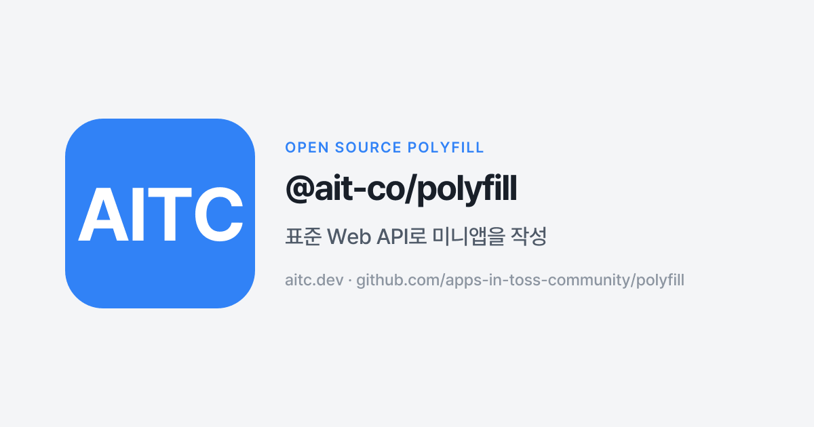

# @ait-co/polyfill

**한국어** · [English](./README.en.md)



[](https://www.npmjs.com/package/@ait-co/polyfill)
[](./LICENSE)

앱인토스 미니앱에서 **웹 표준 API를 그대로 사용**해서 개발할 수 있게 해주는 polyfill. 런타임에 앱인토스 환경으로 확인된 경우에만 SDK로 라우팅하는 shim을 설치하고, 그 외 환경(일반 브라우저, 로컬 개발, 테스트)에서는 **아무것도 하지 않아** 브라우저의 원본 구현이 그대로 동작합니다.

## 설치

```sh
pnpm add @ait-co/polyfill
```

`@apps-in-toss/web-framework`는 **optional peer dependency**입니다. 순수 웹 컨텍스트만 타깃으로 하는 앱이라면 설치하지 않아도 됩니다 — polyfill은 아무 작업도 하지 않고 브라우저 원본이 그대로 동작합니다.

```sh
pnpm add @apps-in-toss/web-framework   # 토스 빌드도 함께 배포하는 경우에만
```

패키지는 ESM + CJS 듀얼 빌드로 제공되므로 CommonJS 환경에서도 `require('@ait-co/polyfill/auto')`가 동작합니다.

## 사용법

### dep만 추가하기 (권장)

앱 시작 시 side-effect 엔트리를 한 번 import하면 됩니다. 감지 + 설치는 자동으로 이루어지며, 일반 브라우저에서는 no-op입니다.

```ts
import '@ait-co/polyfill/auto';

// 이후 어디서든:
await navigator.clipboard.writeText('hello');
```

### 명시적 설치

polyfill이 언제 attach되었는지 알아야 하거나(초기화 게이팅), teardown이 필요한 경우 `install()`을 직접 호출합니다:

```ts
import { install, uninstall } from '@ait-co/polyfill';

const restore = await install(); // 감지 완료 시 resolve

// ...

restore(); // 또는 uninstall()
```

`install()`은 async로, uninstall 함수를 resolve 값으로 반환합니다. 앱인토스 환경이 아니면 반환 함수는 no-op입니다(shim이 설치되지 않았으므로). `install()`을 여러 번 호출해도 안전합니다.

각 shim은 원래의 `navigator`/`window` 값을 저장해 두므로 `uninstall()`이 깔끔하게 복원합니다 — 테스트에서 유용합니다.

### 서브패스 import (번들 크기에 민감한 경우)

auto-install 없이 개별 shim만 선택하려면:

```ts
import { installClipboardShim } from '@ait-co/polyfill/clipboard';

installClipboardShim(); // 조건 없이 설치 — 토스 환경에서만 동작하게 하려면 detect.ts로 게이팅
```

패키지는 `sideEffects: ["./dist/auto.js", "./dist/auto.cjs"]`로 표시되어 있으므로 tree-shaking 시 `/auto` 엔트리(두 포맷 모두)만 유지되고 나머지는 미사용 시 제거됩니다.

## 환경 감지

polyfill은 SDK의 `getAppsInTossGlobals()`를 호출해 앱인토스 환경인지 판단합니다. 이 호출은 동기적이며 브릿지 상수를 읽습니다 — 일반 브라우저에서는 RN 브릿지가 연결되어 있지 않아 동기적으로 throw되므로(마이크로초 단위) 시작 비용은 무시할 수 있습니다.

테스트용으로 `globalThis.__AIT_POLYFILL_FORCE__ = 'toss' | 'browser'`로 감지 결과를 override할 수 있습니다.

## 지원 API

Tier 1 — 전부 출시 완료. 앱인토스 내부에서는 SDK 라우팅이 동작합니다.

| 웹 표준 | SDK 대응 | 추가된 버전 |
|---|---|---|
| `navigator.clipboard.readText()` / `writeText(text)` | `getClipboardText()` / `setClipboardText(text)` | 0.1.0 |
| `navigator.geolocation.getCurrentPosition()` | `getCurrentLocation({ accuracy })` | 0.1.1 |
| `navigator.geolocation.watchPosition()` / `clearWatch()` | `startUpdateLocation(...)` | 0.1.1 |
| `navigator.share({ title, text, url })` | `share({ message })` (세 필드를 `message`로 연결) | 0.1.1 |
| `navigator.vibrate(pattern)` | `generateHapticFeedback(...)` (best-effort, lossy; 아래 참조) | 0.1.1 |
| `navigator.onLine` / `navigator.connection.effectiveType` | `getNetworkStatus()` (읽을 때마다 polling; `change` 리스너가 있으면 polling으로 이벤트 합성) | 0.1.1 |
| `window.open(url, '_blank')` (Tier 2, 제한적) | `openURL(url)` — `_blank`만, stub Window 반환; [Tier 2 평가](#tier-2-평가-2026-05) 참조 | 0.1.9 |

### Tier 1 검증 상태 (2026-05)

각 Tier 1 shim은 출시 전에 세 계층에서 검증됩니다:
자체 `*.test.ts`(단위 테스트, 세 경로: Toss-mock, browser-only, 둘 다 없음),
교차 테스트인 `devtools-composition.test.ts`(단일 `install()` 호출로 devtools SDK mock을 통해 모든 shim 검증),
그리고 `apps-in-toss-community/sdk-example`의 엔드-투-엔드 ApiCard(표준 Web API를 직접 호출).
실제 앱인토스 앱에서의 sanity 확인(miniApp `31146`, `aitc-sdk-example`)이 최종 계층이며,
현재 해당 miniApp이 REVIEW lock 상태여서 "pending"으로 표시됩니다 —
단위 / 구성 / e2e 계층에서 Tier 1 shim이 실패한 적은 없으므로, lock으로 막힌 sanity는 순전히 확인 절차입니다.

| Shim | 단위 | devtools-composition | sdk-example e2e | 실제 앱인토스 앱 |
|---|---|---|---|---|
| clipboard    | ✅ | ✅ | ✅ | pending (31146 REVIEW lock) |
| geolocation  | ✅ | ✅ | ✅ | pending |
| share        | ✅ | ✅ | ✅ | pending |
| vibrate      | ✅ | ✅ | ✅ | pending |
| network      | ✅ | ✅ | ✅ | pending |

`31146`의 REVIEW lock이 해제되면 실앱 컬럼을 follow-up PR에서 채웁니다. 이 과정에서 shim 변경은 없을 것으로 예상됩니다.

## Tier 2 평가 (2026-05)

앞선 로드맵에 나열된 Tier 2 후보들을 SDK 2.5.0 surface(`@apps-in-toss/web-bridge` exports)를 기준으로 평가했습니다. 4개 중 1개는 의도적으로 제한된 형태로 출시하고, 3개는 scope 외로 이동합니다.

| 후보 | 결정 | 근거 |
|---|---|---|
| `window.open` ↔ SDK `openURL` | **제한적 출시** | `openURL`은 기기의 기본 브라우저/연결된 앱으로 URL을 엽니다(React Native의 `Linking.openURL`). 이는 `window.open`의 "다른 곳에서 열기" 의미론인 `_blank`와 좁게 일치합니다. shim은 `target='_blank'`(또는 target 생략) 케이스만 라우팅하며, `_self`와 named target은 네이티브로 통과됩니다. 반환 `Window`는 no-op stub(`closed: true`, 메서드는 모두 no-op)입니다 — 팝업 창을 직접 조작하는 코드는 동작하지 않으며 `openURL`을 직접 호출해야 합니다. |
| `localStorage` ↔ SDK Storage | **제외 → scope 외** | `localStorage`는 동기적(`getItem`이 string을 즉시 반환)이지만 SDK의 `Storage`(`getItem`/`setItem`/`removeItem`/`clearItems`)는 비동기입니다 — 화해 불가능합니다. 더 결정적으로, 네이티브 `localStorage`가 앱인토스 WebView에서 이미 정상 동작하므로 polyfill 자체가 불필요합니다. |
| `history.back()` ↔ SDK `closeView` | **제외 → scope 외** | `closeView`는 미니앱 화면 전체를 닫습니다("닫기 버튼 … 서비스를 종료할 때") — 내비게이션 스택 pop이 아닙니다. `history.back()`을 `closeView()`로 매핑하면 서브 라우트에서 뒤로 갈 때마다 미니앱이 종료됩니다. "nav 스택 바닥인지" 판별할 안전한 heuristic이 없어 false-positive 비용이 너무 큽니다. |
| `document.visibilityState` / `visibilitychange` | **제외 — 불필요** | 표준 Page Visibility API가 앱인토스 WebView에서 이미 정상 동작하며, `onVisibilityChangedByTransparentServiceWeb`은 구조가 다른 transparent-service 전용 이벤트입니다. polyfill이 필요하지 않습니다. |

### `navigator.vibrate` 매핑

웹 `vibrate` 스펙은 duration만 받지만 SDK의 `generateHapticFeedback`은 질적(qualitative) 유형을 받습니다. 앱인토스 내부에서 단일 duration 호출은 다음과 같이 매핑됩니다:

| 입력 | SDK haptic |
|---|---|
| `vibrate(0)` / `vibrate([])` | no-op (네이티브 진동 취소) |
| `vibrate(1..20)` | `tickWeak` |
| `vibrate(21..45)` | `tickMedium` |
| `vibrate(>=46)` | `basicMedium` |
| `vibrate([on, off, on, off, ...])` | 0이 아닌 "on" 슬롯마다 `tap` 발생, `setTimeout`으로 간격 처리 |

길이 기반 매핑은 의미론적 의도(성공/오류/경고)를 복원할 수 없습니다. haptic의 의미를 알고 있다면 헬퍼를 사용하세요:

```ts
import { vibrateSemantic } from '@ait-co/polyfill/vibrate-semantic';

vibrateSemantic('success');   // → SDK 'success'
vibrateSemantic('error');     // → SDK 'error'
vibrateSemantic('warning');   // → SDK 'tickMedium' (직접 대응 없음)
vibrateSemantic('selection'); // → SDK 'tickWeak'  (직접 대응 없음)
```

헬퍼는 아무것도 설치하지 않으며 `navigator.vibrate`를 건드리지 않습니다. 편의를 위해 패키지 root에서도 re-export됩니다(`import { vibrateSemantic } from '@ait-co/polyfill'`). 다만 서브패스 형태가 tree-shake에 유리합니다.

앱인토스 외부에서 `vibrateSemantic`은 짧은 `navigator.vibrate(...)`로 폴백해 사용자가 피드백을 느낄 수 있게 합니다. `navigator.vibrate(...)`는 모든 환경에서 표준 시그니처를 유지합니다 — 의도를 전달하는 유일한 방법은 헬퍼뿐입니다.

### `window.open` 매핑 (Tier 2, 제한적)

```ts
window.open('https://example.com', '_blank'); // → SDK openURL (기기 브라우저)
window.open('https://example.com');            // (target 생략) → SDK openURL
window.open('https://example.com', '_self');   // → 네이티브 (문서 내 내비게이션)
window.open('https://example.com', 'myPopup'); // → 네이티브 (named target)
```

target 매칭은 대소문자를 구분합니다(HTML 스펙상 `_blank`는 소문자 키워드; `_BLANK`는 named browsing context로 처리되어 네이티브로 통과됩니다).

라우팅된(`_blank`) 케이스에서 반환되는 객체는 **no-op stub Window**입니다:
`closed`는 처음부터 `true`이며, `close` / `focus` / `blur` /
`postMessage`는 silent no-op입니다. 팝업 창을 직접 조작하는 코드
(폼 제출, `postMessage` 왕복, `closed` polling)는 shim을 통해
지원되지 않습니다 — 그 경우 `@apps-in-toss/web-framework`의
`openURL`을 직접 호출하세요.

채택 가이드(Vite + React 스니펫, `@ait-co/devtools`와의 권장 조합, API별 한 줄 예제)는 [`INTEGRATION.md`](./INTEGRATION.md)를 참조하세요.

웹 표준에 합리적으로 대응되지 않는 API(인증, IAP, 광고, 분석, 토스 고유 환경 정보 등)는 `@apps-in-toss/web-framework` 네임스페이스에 남습니다 — polyfill은 "SDK가 하는 모든 것의 집"이 아닙니다. 근거는 [`CLAUDE.md`](./CLAUDE.md)에서 확인할 수 있습니다.

scope 외로 결정된 Tier 2 후보들(Storage, `history.back`, `visibilitychange`)은 근거와 함께 [Tier 2 평가](#tier-2-평가-2026-05)에 정리되어 있습니다.

## 텔레메트리 / Sentinel

이 패키지는 자체 텔레메트리를 보내지 않습니다. 다만 사용 여부 신호를 위해 `globalThis.__AIT_POLYFILL__` sentinel을 노출하며, devtools 컴패니언이 활성 상태일 때만 (devtools opt-out 미적용 사용자 한정) 이 신호를 익명 daily ping에 포함시킬 수 있습니다.

```ts
// read-only, non-enumerable — 애플리케이션 코드에서 직접 사용하지 마세요.
// devtools 내부 contract입니다.
globalThis.__AIT_POLYFILL__; // { version: string; loaded: true }
```

프라이버시 정책: <https://docs.aitc.dev/privacy>

## 개발

```sh
pnpm install
pnpm test
pnpm lint
pnpm typecheck
pnpm build
```

### Pre-commit hook

선택 사항이지만 권장합니다. clone 후 표준 pre-commit hook을 활성화하면 staged 파일에 `biome check`가 자동으로 실행됩니다:

```sh
git config core.hooksPath .githooks
```

push 전 빠른 피드백을 위한 개발자 편의 기능입니다. CI에서도 동일한 검사가 강제 계층으로 실행되므로 hook을 활성화하지 않은 contributor도 PR에서 lint 실패를 확인할 수 있습니다.

## 라이선스

BSD-3-Clause

---

커뮤니티 오픈소스 프로젝트입니다.
